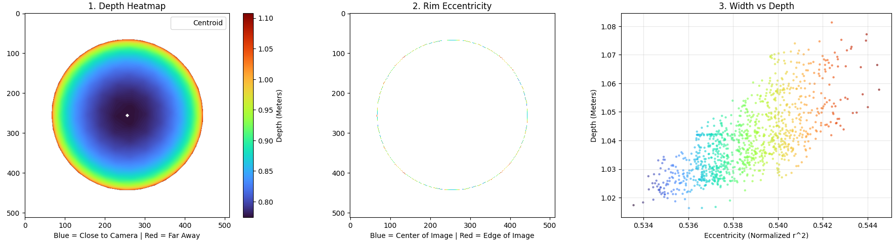
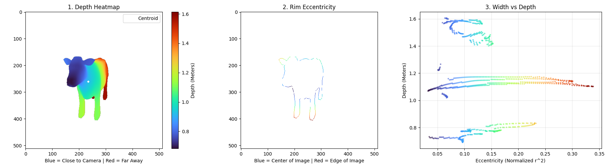

# Object Analyzer: 3D Silhouette & Depth Correlation
This repository implements a computer vision pipeline to analyze the statistical relationship between 3D object geometry and its 2D silhouette.  
Specifically, it tests the hypothesis that **rim eccentricity** is linearly correlated with **depth**.  
Paper Reference: https://www.elderlab.yorku.ca/wp-content/uploads/2023/09/QianCRV23.pdf
## Overview
The core idea is to determine if 3D depth information can be inferred solely from the 2D shape of an object's silhouette.
- **Input**: A raw 3D mesh (.obj).
- **Process**:  
  1\. Normalize and center the mesh.  
  2\. Render the object from a specific calibrated viewpoint using offscreen EGL rendering.  
  3\. Extract the Occluding Contour (Rim) and calculate the radial eccentricity ($r^2$) for every pixel.  
  4\. Correlate these values with the Ground Truth Depth Map.  
- Output: Statistical visualization of the Eccentricity vs. Depth relationship.  
## Experimental Results
**1. Control Test: The Sphere**  
To validate the mathematical pipeline, we first tested a perfect sphere.
- **Expectation**: A near-perfect constant or linear relationship.
- **Result**: The pipeline produced a near-perfect correlation curve, confirming that the coordinate transformations and metric extractions are correct.  


**2. Complex Morphology: The Cow**  
We then applied the method to a non-convex organic shape (cow.obj) to reproduce the results described in the reference paper.

**Observations**: Unlike the smooth linear trends presented in the paper, our analysis revealed a more complex "Layered" structure.
- **Topological Separation**: Instead of a single continuous curve, the data clustered into distinct "shelves" corresponding to different body segments (Head, Torso, Rear Legs).
- **Local vs. Global Linearity**: While individual body parts (like the torso) showed the expected positive slope (increasing depth with increasing width), the global relationship was disrupted by the empty space between limbs.
- **Conclusion**: The results suggest that the simple "Eccentricity = Depth" hypothesis holds for locally convex segments but breaks down for global topology where occlusion occurs (e.g., legs obstructing the torso). This diverges from the smoother curves presented in the original study.  

## Tech Stack
- **Language**: Python 3.10+
- **Rendering**: Pyrender (EGL Backend for headless rendering)
- **Geometry**: Trimesh (Mesh loading, normalization, and sanitization)
- **Analysis**: NumPy & SciPy (Matrix manipulation and morphological operations)
- **Visualization**: Matplotlib (Custom 3-panel statistical plots)
## Usage
**1. Clone the repository**:
  ```Bash
  git clone https://github.com/YOUR_USERNAME/Object_Rim_Estimator_From_Contour.git
  cd object-analyzer
  ```
**2. Install dependencies**:
  ```Bash
  pip install numpy scipy matplotlib trimesh pyrender
  ```  
  Note: If running on Linux/Headless, ensure EGL drivers are installed.  
**3. Run the analysis**:
  ```Bash
  python objectAnalyzer.py
  ```
